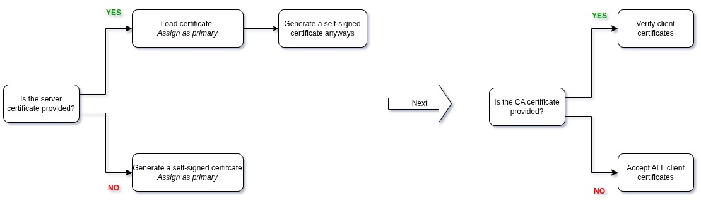
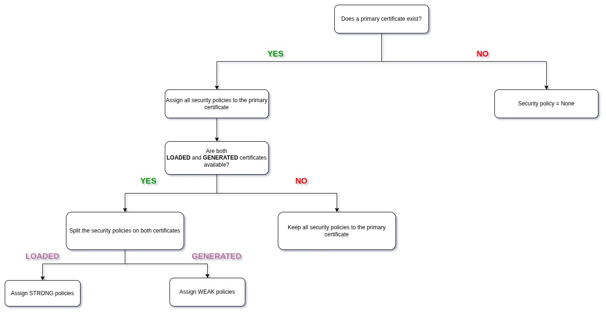

# OPC UA Logic Overview

## Client Connection Steps

Before any data exchange between the server and the client, the connection goes through the following steps:

### 1. Discovery
Before any security is negotiated, the client calls `getEndpoints` to know about:

- Which endpoints exist
- Which security policies are supported
- Which message security modes are allowed
- The server certificate

Then, the client selects a specific configuration.

### 2. Secure Channel Creation

This is where the **application authentication** happens following the steps ahead:

- *Client sends an Open Secure Channel Request*

    The client specifically sends:

    - Its **Application Instance Certificate**
    - A nonce (random number)
    - Requested security mode
    - Requested security policy

    If using `Sign` or `SignAndEncrypt`, this message is:

    - Signed with the client’s private key

- *Server Validates Client Certificate*

    The server checks if:

    - The certificate can be trusted
    - It is expired or revoked
    - The ApplicationURI matches the certificate
    - It is allowed by the policy

    If not trusted, it goes to the **RejectedCertificates folder** and the connection **fails**.

- *Server Responds*

    Server sends back:

    - Its certificate
    - Server nonce
    - Security token ID
    - Lifetime of token

    Signed with server private key.

    At the end of this step, both sides have each other's **certificate** and **nonce**.

- *Symmetric key derivation*

    Both sides compute symmetric keys using:

    - Client nonce
    - Server nonce

    From this they derive:

    - Encryption key
    - Signing key
    - Initialization vector

    After this point, all messages use symmetric encryption (AES).

### 3. Session Creation

The client sends a `Create Session Request` with:

- Client description
- Session name
- Client nonce
- Client certificate
- Requested timeout

Server responds with:

- Session ID
- Authentication token
- Server nonce
- Server certificate (again for verification)

**Important:** The session is **created** but **NOT** **activated** yet.

### 4. User Authentication

Now, the client sends an `Activate Session Request.`

This includes:

- User Identity Token
- Signature over server nonce

If **valid**, the **session** becomes **active** and the user **permissions** are **assigned**.

If **invalid**, the **session** is **rejected**.

### Notes:

Secure channels have a **limited** **lifetime**. Before expiration, the client sends a renewal flag (OpenSecureChannel Request). New keys are generated and the session continues without interruption.

A graceful shutdown consists of a CloseSession --> CloseSecureChannel --> Close TCP Connection.

If the connection is lost, the server times out the session and the subscriptions are deleted.

---

## Example Server Connection Logic

The example server (`example_server.cpp`) provides configurable security based on X.509 certificates and standard OPC UA security policies.

It is possible to provide server and client certificates and keys. A self-signed certificate is always generated afterwards in order to allow encrypted communication.

CA certificates, though optional, can be used for client certificates verification.

The certificate loading and generation is done according to the following logic:

The server also exposes multiple endpoints accessible through the same URL `opc.tcp://ip_address:4840`.

Each endpoint has a **different** combination of OPC UA **security policies** and **message security modes**.
Available security policies include:
- None
- Basic256Sha256
- Aes256_Sha256_RsaPss
- Aes128_Sha256_RsaOaep

The policies are assigned to the certificates as follows:

The endpoints are then sorted by their security levels so that the client can select the **most secure** option available.

---
